# JS-Bird 
An interactive tool for writing hybrid JS / Blackbird code in an editor.

This is a project developed for the **Xanadu QHack 2023** *Hybrid Quantum-Classical Computing Challenge*. The motivation for this editor is *enhance the processing* of results for any executable [BlackBird](https://quantum-blackbird.readthedocs.io/en/latest/index.html) program by incorporating JS based processing.

The editor expects 1 Blackbird block followed by 1 JS block. Both are executed, one with the help of a StrawberryFields based backend API and one using eval() in the frontend. Both may be edited together in one editor application where the results of their executions may also be viewed.

### Design

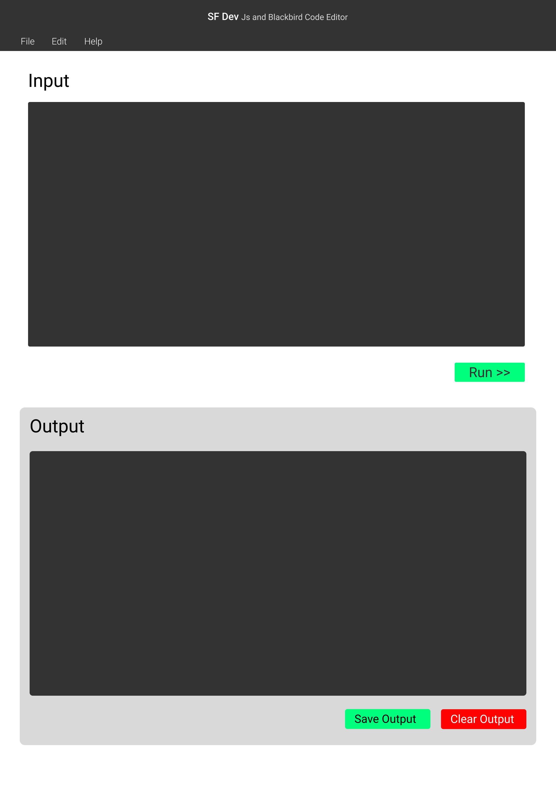
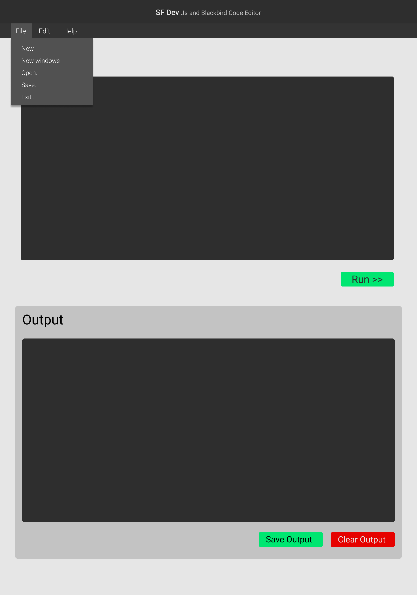
 

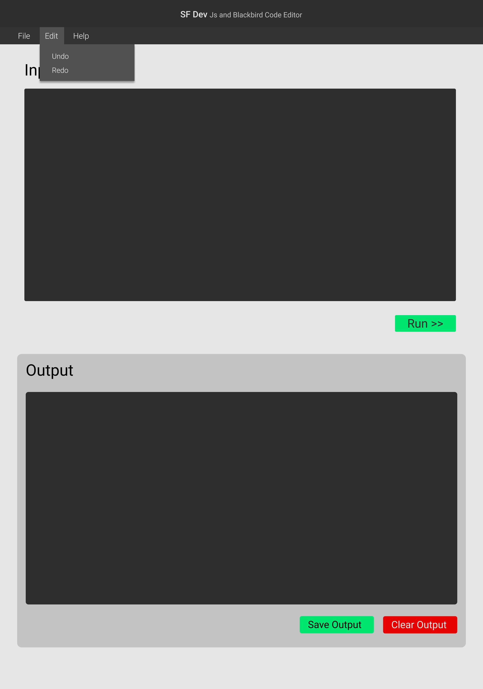
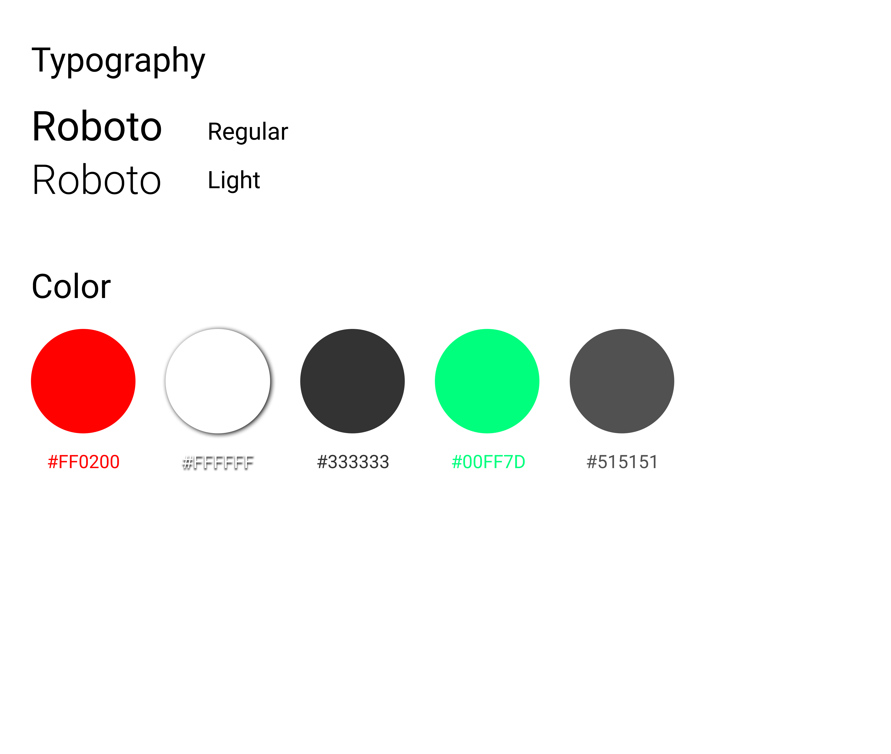
 

### App Demo 
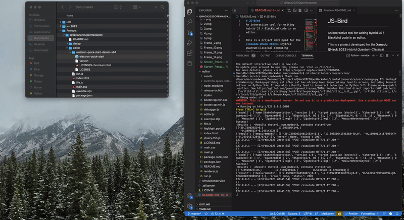

**
1. The StrawberryFields / JS editor
**
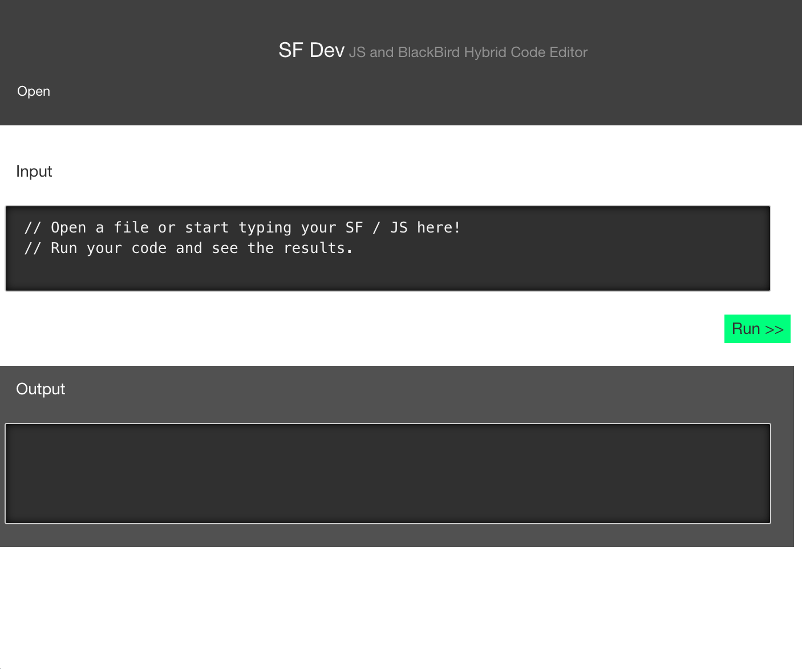

**
2. Opening a file in Editor
**
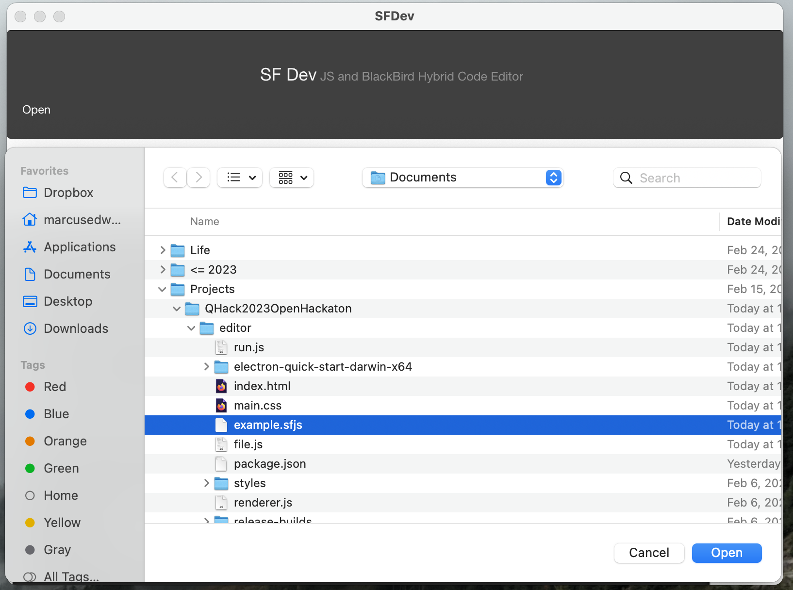

**
3. Editing a file containing a Blackbird followed by a JS block
**
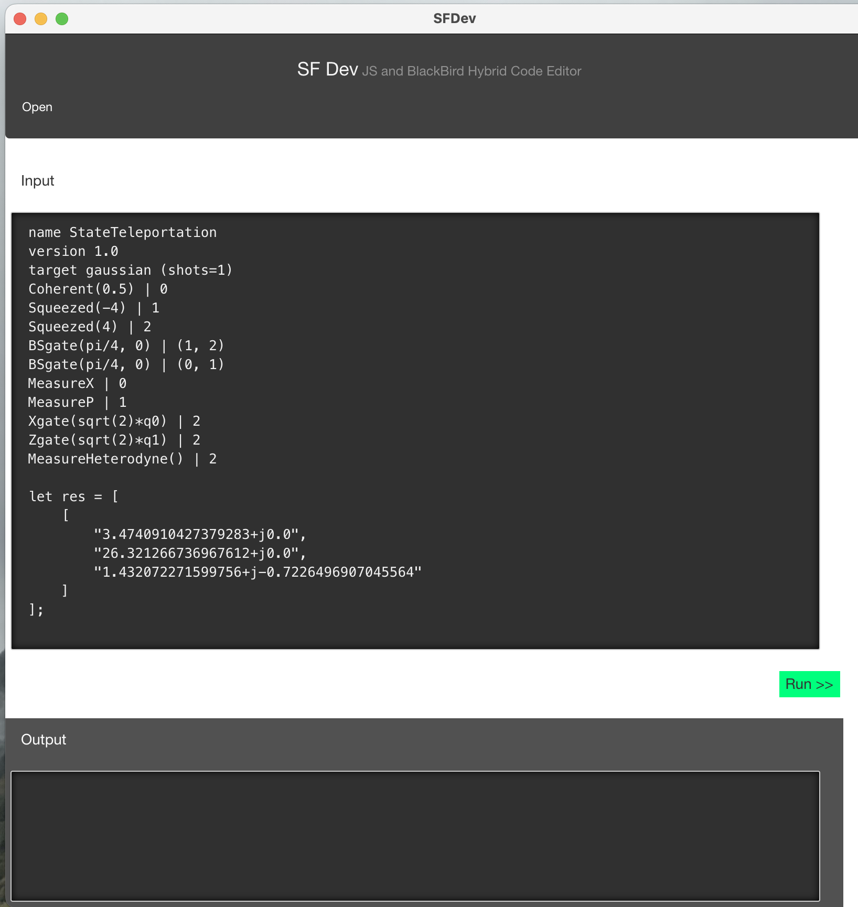

**
4. Running the code
**

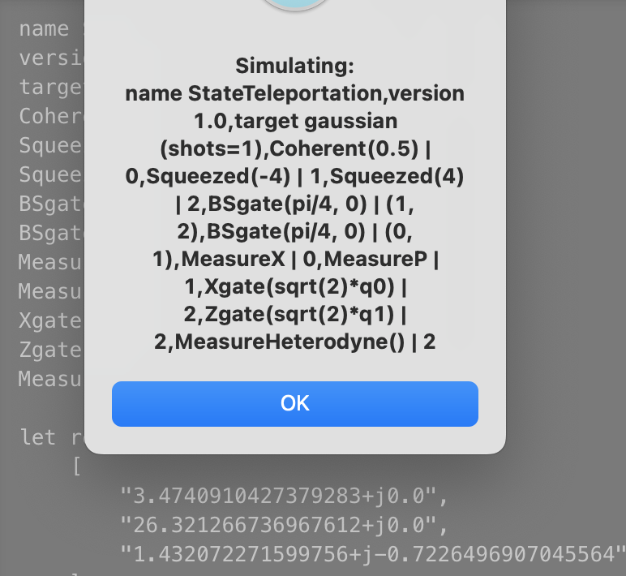
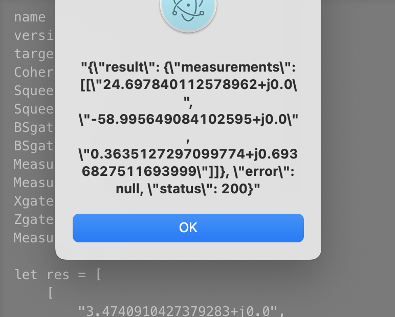
 

 
 
**
5. Viewing the output
**
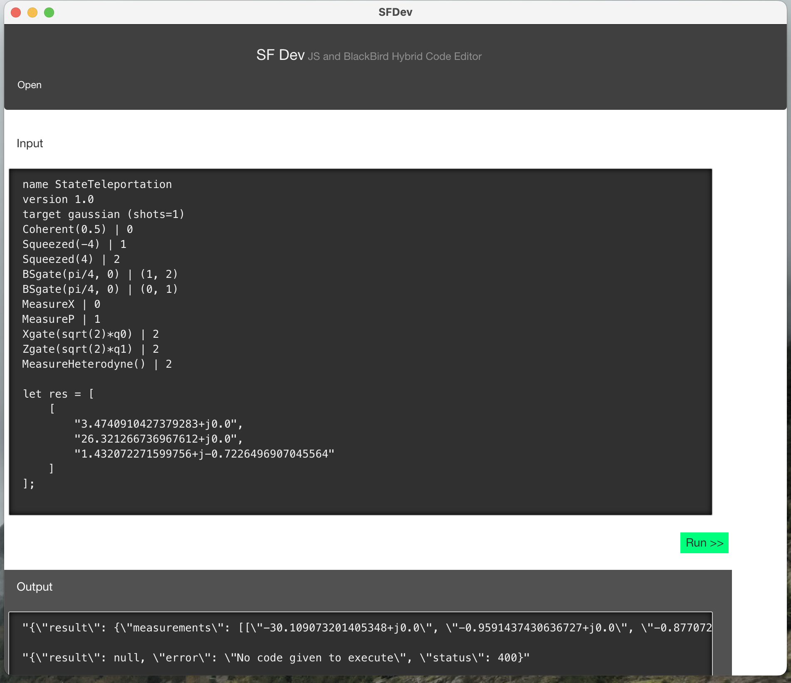

### Usage Info 
 Currently our application is supported over the **MacOS** and the installation instructions are as follows - 

1. Clone the repository via `git clone <repo_link>`
2. Build the editor using the following steps - 
   a. Make sure you have `node` installed in your machine
   b. Open a terminal and go into the `editor` directory and type `npm install` to install the necessary packages 
   c. Run the following in the project directory:
`
npm install electron-packager -g &&
electron-packager .
`
   d. Open the app in the build directory

3. Build and run the `flask` server as follows - 
    a. Make sure you have `python` and `pip` installed in your machine
    b. Open a new terminal and go into the `simulationservice` directory
    c. Type `pip install -r requirements.txt` to install necessary packages
    d. After this, go into the `service` directory and type `set FLASK_APP=app.py` followed by `flask run` to start the server

4. Execute code from the editor as highlighted in the application demo. 

### Technologies Used

1. **Editor** - jQuery, ElectronJS
2. **Simulation Service** - Flask, StrawberryFields

### Future Scope 

- Support multiple blocks of each of SF and JS code
 
### Team - Q I/O

1. [Ezekiel Ekondu Emmanuelaudu](https://i-ex3c.github.io/Portfolio/)
2. [Harshit Gupta](https://github.com/TheGupta2012)
3. [Marcus Edwards](https://github.com/comp-phys-marc)
4. [Sairaaj Surve](https://github.com/SairaajSurve)

